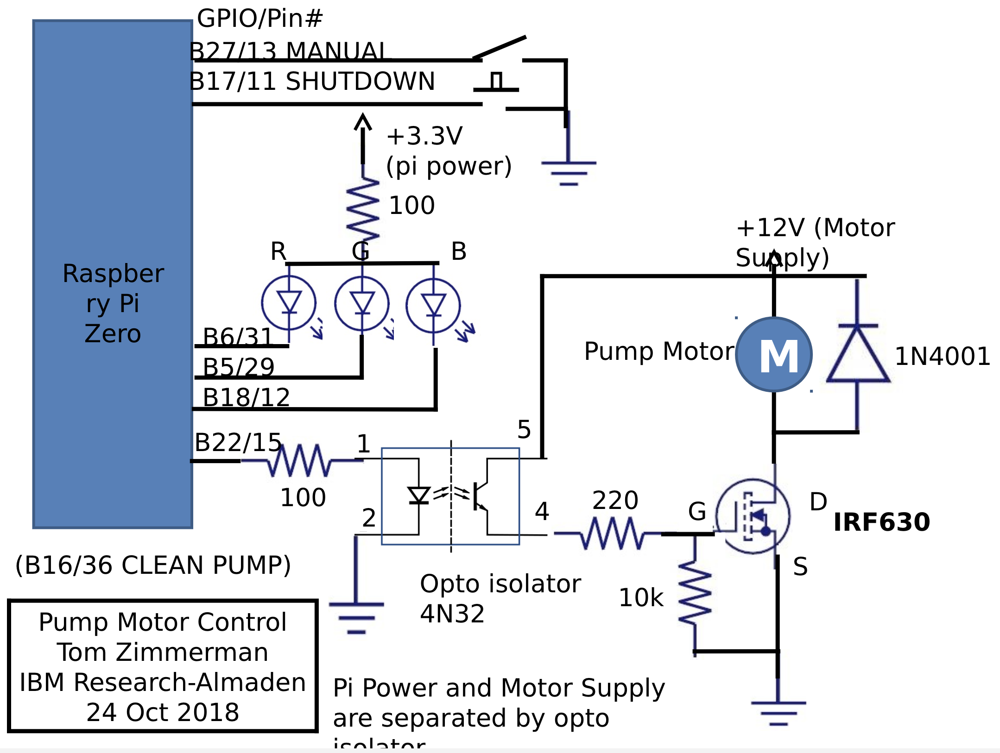

## Schematic

~~~bash
.
├── Installation.docx
├── Pump_Code
│   ├── config.txt
│   ├── configuration.py
│   ├── dropbox_upload_delete.py
│   ├── microscope.py
│   └── pump_system.py
├── README.docx
├── README.md
├── download_delete.py
└── pics
    └── pic.png
~~~
